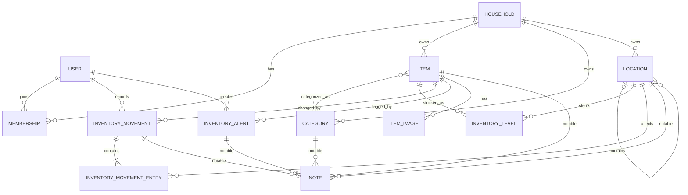

# Household Inventory: Domain Model and Core Workflows

Status: Planning draft  
Last updated: 2026-09-07

## Product purpose

The application serves two equally important needs:

1. Surface household supplies that need attention because a monitored stock location is low or empty, or because a household member manually marked an item as "buy soon."
2. Answer whether the household has a particular item, how many it has, and where those items are stored.

It is an inventory application, not a shopping-list or purchasing application.

## Decisions already made

- The backend is a Laravel JSON API.
- The frontend is a Vue 3 SPA under Laravel's `resources` directory.
- Laravel is installed at the repository root; Composer, npm, Vite, and application configuration remain at the root.
- The application uses MySQL.
- API responses will follow JSON:API conventions closely, without claiming strict conformance.
- Fractal will transform API resources through an application-specific serializer.
- Spatie Laravel Query Builder will provide consistent filtering, sorting, includes, and field selection on collection endpoints.
- Items do not have variants, facets, or ad-hoc structured properties.
- Each distinct variation is represented by a descriptively named item, such as `Garden hose 10 ft Blue`.
- Item search initially uses a simple, case-insensitive partial match against the item name.
- Items may belong to multiple categories; there is no primary category.
- An item may be stocked in multiple locations.
- Inventory may be assigned directly to any active location, including a location that also has children.
- Each item stores one singular counting unit, such as `roll`, `box`, `bag`, or `filter`. Laravel pluralizes it for display according to the quantity. Package conversions are outside the initial scope.
- Low-stock thresholds are configured per item and location, not globally on an item.
- A location with no threshold never creates an automatic dashboard alert.
- A user may manually flag an item as "buy soon" regardless of its recorded quantity.
- Automatic refill recommendations, refill targets, and replenishment chains are outside the initial scope.
- "Archive" means a Laravel soft delete. An item must be soft-deleted before it can be permanently deleted.
- Permanent deletion cascades through exclusively owned data when it can do so without leaving orphans or damaging records that belong to other surviving models. Otherwise, permanent deletion is blocked until dependencies are handled.
- Laravel timestamps are not added to every model by default. Dates are stored only when they have domain meaning.
- Durable user-managed records generally use Laravel soft deletes. Ledger, state, and join records use lifecycle rules appropriate to their purpose instead.
- Notes are polymorphic through Laravel's `notable` convention.
- An item may have multiple item-specific images, with one image designated as primary. Images are not polymorphic.

## Domain language

### Item

A kind of household supply or possession tracked as a single inventory identity. Distinguishing characteristics are part of its descriptive name.

Examples:

- `Toilet paper`
- `Garden hose 10 ft Blue`
- `Furnace filter 20x25x1 MERV 11`

### Counting unit

The smallest practical unit used consistently when counting an item across every location.

Examples:

- Toilet paper is counted in `rolls`.
- Facial tissue is counted in `boxes`.
- Dishwasher detergent is counted in `tablets`.

Retail packaging is not an inventory unit. A 30-roll package and a 32-roll package both add their actual number of rolls to inventory.

### Inventory level

The current quantity of one item at one location. It may optionally have an alert threshold.

### Inventory movement

An auditable change to inventory. A movement records a restock, transfer, consumption, correction, or disposal.

### Automatic alert

A calculated dashboard condition produced when an inventory level has a threshold and its quantity is at or below that threshold.

### Manual alert

A persisted, user-created "buy soon" flag. It expresses intent rather than claiming that the recorded quantity is low or empty.

## Relationship overview



## Proposed models

### Household

Represents the ownership and authorization boundary.

Proposed fields:

- `id`
- `name`
- soft deletes

### User and Membership

Users have individual accounts and join a household through a membership record.

Proposed membership fields:

- `id`
- `household_id`
- `user_id`
- `role` (`owner` or `member`)
- `joined_at`
- soft deletes

All members initially have equal inventory permissions. Only an owner manages household membership or performs household-level destructive operations.

### Item

Proposed fields:

- `id`
- `household_id`
- `name`
- `counting_unit`
- `description`, nullable
- soft deletes

Rules:

- The item name includes any distinction the household cares about.
- `description` is the item's single current descriptive summary and is distinct from its chronological notes.
- `counting_unit` is an editable display label and is not used for quantity conversion or calculation.
- Changing the counting unit relabels current and historical quantities without changing their numeric values.
- Saving trims the name and collapses accidental repeated whitespace.
- Item names are unique within a household under the database's case-insensitive collation.
- Archived items continue to reserve their names.
- Similar but nonidentical names are allowed; the application performs no fuzzy duplicate enforcement.
- An item remains searchable at a quantity of zero.
- Archived items are excluded by default but may be requested with an explicit trashed filter.

### Category

Proposed fields:

- `id`
- `household_id`
- `name`
- soft deletes

Items and categories have a many-to-many relationship through `category_item`. The pivot has a unique constraint on `(category_id, item_id)` and has neither timestamps nor soft deletes.

Soft-deleting an item or category preserves its pivot rows so restoration also restores the prior assignments. Normal relationships and category item counts exclude archived resources, and active items cannot be newly assigned to archived categories. Permanently deleting either side detaches its pivot rows.

Category names are unique within a household under the database's case-insensitive collation. Archived categories continue to reserve their names.

### Location

Proposed fields:

- `id`
- `household_id`
- `parent_id`, nullable
- `name`
- `description`, nullable
- soft deletes

The optional parent supports a browseable hierarchy such as:

```text
Basement
└── Storage room
    └── Metal shelf
```

Inventory may be assigned to any active location. The UI may encourage the most specific useful location, but it never requires a leaf location. Adding a child does not relocate inventory already assigned to its parent.

The hierarchy uses a simple adjacency list through `parent_id`. Root locations have no parent. A parent must belong to the same household, and a location may not be its own parent or be placed beneath one of its descendants. Descendant-inclusive queries use recursive traversal; the initial schema does not use nested-set fields or a closure table. Reparenting changes only the moved location's `parent_id`.

Location names are unique among siblings under the database's case-insensitive collation. The same name may be used beneath different parents. Archived locations continue to reserve their sibling-level names.

`description` is the location's single current descriptive summary and is distinct from its chronological notes. Categories and other initial domain models do not have dedicated description fields.

Location views distinguish:

- inventory assigned directly to the selected location; and
- aggregate inventory within the selected location, including all descendants.

Archiving rules:

- A location with positive inventory directly assigned to it cannot be archived.
- A location with active child locations cannot be archived.
- Direct inventory must first be transferred or corrected to zero.
- Active children must first be reparented or archived.
- Zero-quantity inventory levels do not block archiving.
- These checks apply to the archive operation itself; inventory must never disappear merely because its location was hidden.

### InventoryLevel

Proposed fields:

- `id`
- `item_id`
- `location_id`
- `quantity`, unsigned integer
- `alert_threshold`, unsigned integer and nullable

Constraints and rules:

- `(item_id, location_id)` is unique.
- Quantity may not be negative.
- `alert_threshold = null` disables automatic alerts for this level.
- Every newly created inventory level defaults to `alert_threshold = null`; monitoring is enabled only through an explicit user action.
- A configured threshold of `0` alerts only when the level is empty.
- A positive threshold alerts when `quantity <= alert_threshold`.
- Item-level total quantity is the sum of all active inventory levels.
- An empty, unmonitored level is still displayed as empty when browsing but does not appear on the dashboard.
- Inventory levels are current-state records. They are not timestamped or soft-deleted, and an empty level may remain available for later reuse.
- Existing zero-quantity levels retain their configured threshold when restocked or reused.

### InventoryMovement

Proposed fields:

- `id`
- `household_id`
- `item_id`
- `movement_type` (`restock`, `transfer`, `consumption`, `correction`, or `disposal`)
- `recorded_by`
- `recorded_at`

Each movement contains one or more entries:

- `id`
- `inventory_movement_id`
- `location_id`
- `quantity_delta`, signed integer
- `balance_after`, unsigned integer

Rules:

- A transfer contains a negative source entry and an equal positive destination entry.
- A restock contains one positive destination entry.
- Consumption and disposal contain one negative source entry.
- A correction contains one signed entry representing the difference between the recorded and observed quantities.
- The sum of a transfer's entry deltas must be zero.
- A movement records the event; `InventoryLevel.quantity` stores the current balance for efficient reads.
- The movement, its entries, and all affected inventory levels are written in one database transaction.
- Inventory writes use row locking or an equivalent concurrency strategy to prevent lost updates.
- Movements and entries are immutable ledger records. They are neither updated nor soft-deleted through normal application workflows.
- Movements use the shared polymorphic notes relationship. Adding, editing, or soft-deleting an annotation does not alter the immutable movement facts.
- `movement_type` is stored as a string and cast to a PHP-backed `MovementType` enum. The schema does not use MySQL's native `ENUM` type.
- `recorded_at` is assigned by the server when the movement transaction succeeds, stored in UTC, and immutable.
- Movements have no generic `created_at` or `updated_at`. A future need to backdate real-world activity would add a separate optional `occurred_at` rather than changing the meaning of `recorded_at`.

### InventoryAlert

This model stores only manual alerts. Automatic threshold alerts are calculated from inventory levels.

Proposed fields:

- `id`
- `household_id`
- `item_id`
- `alert_type` (`buy_soon` initially)
- `created_by`
- `created_at`
- `resolved_at`, nullable
- `resolved_by`, nullable

Rules:

- An unresolved alert is active.
- An item may have at most one active household-wide `buy_soon` alert unless a future workflow demonstrates the need for multiples.
- Manual alerts are always item-wide. Location-specific stock attention is represented by inventory-level thresholds.
- Restocking does not automatically resolve a manual alert in the initial release.
- Resolving an alert preserves its history.
- Resolved alerts remain indefinitely as inactive history. `resolved_at`, rather than a soft delete, controls this lifecycle.
- Manual alerts use the shared polymorphic notes relationship rather than a dedicated text field.
- `alert_type` is stored as a string and cast to a PHP-backed `InventoryAlertType` enum. The schema does not use MySQL's native `ENUM` type.

### ItemImage

Proposed fields:

- `id`
- `item_id`
- `disk`
- `thumbnail_path`
- `thumbnail_mime_type`
- `thumbnail_width`
- `thumbnail_height`
- `display_path`
- `display_mime_type`
- `display_width`
- `display_height`
- `caption`, nullable
- `is_primary`
- `uploaded_by`
- `uploaded_at`
- soft deletes

Rules:

- An item may have multiple images.
- Exactly one active image is designated as primary whenever an item has active images.
- The first image becomes primary automatically; deleting the primary promotes the oldest remaining active image.
- Changing the primary image is transactional.
- Non-primary images are ordered by `uploaded_at`; manual ordering is outside 1.0.
- Captions provide optional human-readable context; images have no separate kind or classification field.
- Storage uses Laravel's filesystem abstraction so local and object storage can be selected by configuration.
- The configured disk stores only a 320 by 320 maximum thumbnail and a 1920 by 1080 maximum display derivative, both aspect-preserving and without upscaling.
- The temporary upload is discarded after both derivatives are persisted; no original file or original filename is retained.
- JPEG, PNG, and WebP uploads up to 20 MB are accepted in 1.0; SVG and animated images are rejected.
- HEIC/HEIF support is deferred to a future version. For 1.0, these photos must be exported to an accepted format before uploading.
- Orientation is normalized and metadata, including GPS data, is stripped before both derivatives are encoded as WebP with transparency preserved when applicable.

### Note

Proposed fields:

- `id`
- `notable_type`
- `notable_id`
- `body`
- `created_by`
- `created_at`
- `updated_at`
- soft deletes

Items, categories, locations, inventory movements, and inventory alerts use a shared `HasNotes` trait defining a polymorphic `notes()` relationship.

## Calculated states

Inventory truth and dashboard attention are intentionally separate.

### Level stock state

- `empty`: quantity is `0`
- `in_stock`: quantity is greater than `0`

### Level attention state

- `unmonitored`: threshold is null
- `empty`: threshold is configured and quantity is `0`
- `low`: threshold is configured, quantity is greater than `0`, and quantity is at or below the threshold
- `okay`: threshold is configured and quantity is above the threshold

### Item summary

An item response may include calculated values such as:

- `total_quantity`
- `location_count`
- `has_automatic_alerts`
- `has_manual_alert`

These are derived values rather than item columns.

## Timestamp and deletion policy

Laravel's automatic timestamps are disabled unless both `created_at` and `updated_at` are useful to the domain.

- Items, categories, locations, households, memberships, images, and notes are durable user-managed records and support soft deletion.
- Notes retain `created_at` and `updated_at` because chronology and edits are meaningful.
- Images use `uploaded_at`; an ordinary update timestamp does not add useful information.
- Inventory movements use the immutable event time `recorded_at`.
- Manual alerts use `created_at` and `resolved_at`; they are resolved rather than soft-deleted or pruned.
- Inventory levels represent current state and have neither timestamps nor soft deletes.
- Movement entries inherit their event time from their parent movement and have neither timestamps nor soft deletes.
- Many-to-many assignment rows, such as `category_item`, are attached or detached rather than archived.

Automatic threshold alerts do not have database rows. They disappear automatically as soon as their inventory level rises above its threshold or monitoring is disabled. Manual alerts remain active until `resolved_at` is set and then remain indefinitely as inactive history. The initial application requires no recurring alert-maintenance task.

## Core workflows

### Find an item

1. Search item names with a case-insensitive partial query, such as `hose`.
2. Review results containing the descriptive item name, total quantity, and storage locations.
3. Open an item to see its per-location breakdown, images, notes, and history.

### Browse inventory

1. Open the dedicated inventory index.
2. Browse or filter items by category, location, stock presence, or attention state.
3. Sort and paginate using the standard API query contract.

### Browse by location

1. Navigate the location hierarchy.
2. Open a location to view items stored directly there.
3. View a separate aggregate containing items in the location and all descendants.

### Add an item

1. Enter a descriptive name and counting unit.
2. Assign zero or more categories.
3. Optionally add an initial location and quantity.
4. Optionally configure that location's alert threshold.
5. Optionally add images and notes.

### Restock from outside the household

1. Select the item and destination location.
2. Enter the quantity in the item's counting unit.
3. Save a `restock` movement.
4. Increment or create the destination inventory level.

Retail package arithmetic is performed by the person entering the movement. For example, two 32-roll packages are entered as a restock of 64 rolls.

### Transfer between locations

Transfers support two user-facing directions while creating the same domain movement.

Transfer out (push):

1. Begin from an item/location row with a positive balance.
2. Keep that location fixed as the source.
3. Choose any other active location as the destination and enter a quantity no greater than the source balance.

Transfer in (pull):

1. Begin from an item/location row that will receive inventory.
2. Keep that location fixed as the destination.
3. Choose a source from other locations where the same item has a positive balance.
4. Enter a quantity no greater than the selected source balance.

Both directions then:

1. Record one transfer movement with equal negative and positive entries.
2. Atomically update both inventory levels.
3. Create the destination level if it does not yet exist.

The interface uses explicit `Transfer out` and `Transfer in` labels and confirms the final sentence, for example: `Move 5 rolls from Basement to Main pantry.`

### Record consumption or disposal

1. Select the item and source location.
2. Enter the quantity consumed or discarded.
3. Record the movement and decrement the level without allowing a negative balance.

### Correct an inaccurate count

1. Enter the actual quantity observed at a location.
2. Calculate the difference from the recorded quantity.
3. Save a correction movement entry containing the signed effect and resulting quantity.

The correction workflow accepts the observed final quantity rather than asking the user to calculate a positive or negative adjustment. It is a deliberate workflow for fixing an inaccurate count, not a quick inventory action.

If the active location exists but the item has no inventory level there, correction treats the recorded quantity as zero. A positive observed quantity creates the missing level with `alert_threshold = null` and records the positive correction. This represents discovering stock that was already present rather than restocking it from outside the household. An observed quantity equal to the recorded quantity is a no-op and does not create a movement.

The frequent quick quantity action is `Consume one`, which records a consumption movement of one counting unit at a specific location. Inventory additions use the explicit restock or transfer workflows.

Consumption is exposed only in the context of a specific inventory level. There is no item-wide consume action. On an item detail page, each location row exposes its own consume, restock, and transfer actions. A level with zero stock does not display or allow consumption.

### Configure an automatic alert

1. Open the item/location inventory level.
2. Enter a threshold or disable monitoring by clearing it.
3. Let the dashboard calculate whether that level is out, low, or okay.

### Mark an item as buy soon

1. Choose "Buy soon" from the item or a quick action.
2. Optionally record a reason such as seasonal demand.
3. Display the manual alert on the dashboard regardless of current quantity.
4. Resolve it manually after action is taken.

### Archive, restore, and permanently delete an item

1. Archiving uses Laravel's soft delete behavior.
2. Archiving is blocked while any inventory level has positive quantity or the item has an unresolved manual alert; the API returns `409 Conflict` with the blocking conditions.
3. Remaining stock must be consumed, disposed, transferred, or corrected to zero, and active manual alerts must be resolved explicitly.
4. Archived items leave normal inventory, browsing, search, and alert results.
5. Zero-quantity levels, category assignments, images, notes, manual-alert history, and movement history remain attached for restoration.
6. An authorized user may restore an archived item.
7. Permanent deletion is exposed only for an already archived item.
8. Permanent deletion requires a separate confirmation and authorization policy check.
9. Permanently deleting an item also deletes its inventory levels, movement history and entries, images and stored files, notes, manual alerts, and category assignments.

### Permanently delete a category or location

- A category must first be archived. It may then be permanently deleted because its assignments can be detached and its exclusively owned notes can be deleted without affecting the items.
- A location must first be archived. It may be permanently deleted only when it has no child locations, inventory levels, or movement entries.
- A referenced location remains archived until those dependencies are removed through their normal domain workflows; permanent deletion does not silently rewrite or damage surviving inventory history.

## Dashboard composition

The dashboard does not contain the complete inventory.

It combines:

- Automatic out-of-stock alerts from monitored inventory levels
- Automatic low-stock alerts from monitored inventory levels
- Active manual `buy_soon` alerts
- Quick search
- Quick add, consume-one, and alert actions
- Access to the less-frequent restock, transfer, correction, and disposal workflows
- Links to browse items, locations, and categories

## Authorization baseline

- Sanctum authenticates the first-party SPA with stateful session cookies.
- Every household-owned query is scoped to the authenticated user's household.
- Policies authorize access to items, categories, locations, images, notes, movements, and manual alerts.
- Members may view and modify all household inventory, including reversible archive and restore operations.
- Owners additionally manage household settings and memberships and perform permanent deletions.
- The final owner cannot leave the household or be demoted.
- Read-only and custom roles are outside the initial release.
- Each user has exactly one household membership in 1.0.
- Registration creates a new household with the registering user as owner; invited users join an existing household as members.

## Deliberately deferred features

- Shopping lists
- Retailer and price tracking
- Package definitions and unit conversions
- Product families and variants
- Facets or structured item properties
- Barcode or UPC scanning
- Automatic refill recommendations
- Refill targets and replenishment chains
- Seasonal automation
- Usage forecasting and analytics
- Notifications and reminders
- Offline synchronization

## Domain review status

The currently identified domain-model decisions are resolved. New questions may still emerge while defining the API contract and wireframes, but no known domain decision is blocking the next planning stage.
